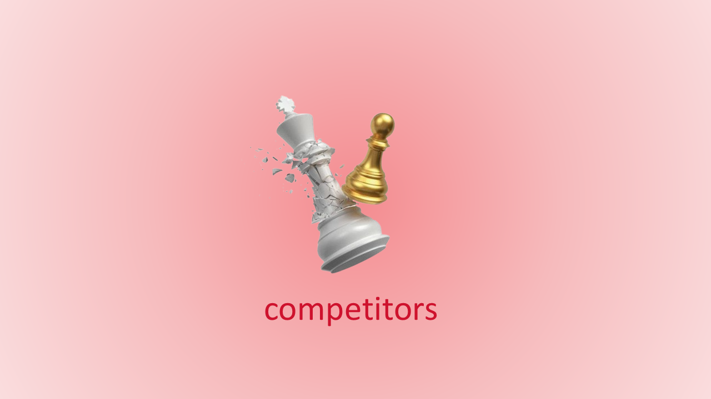
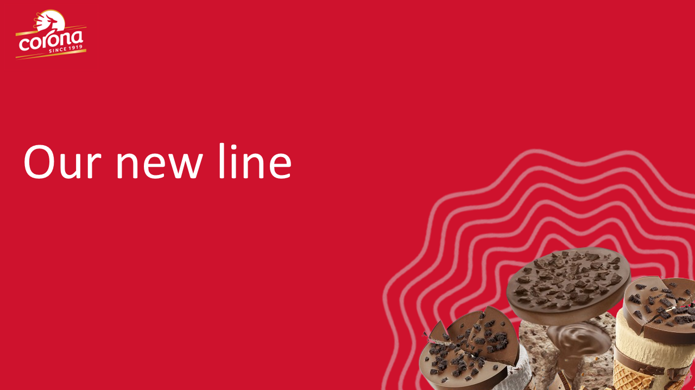
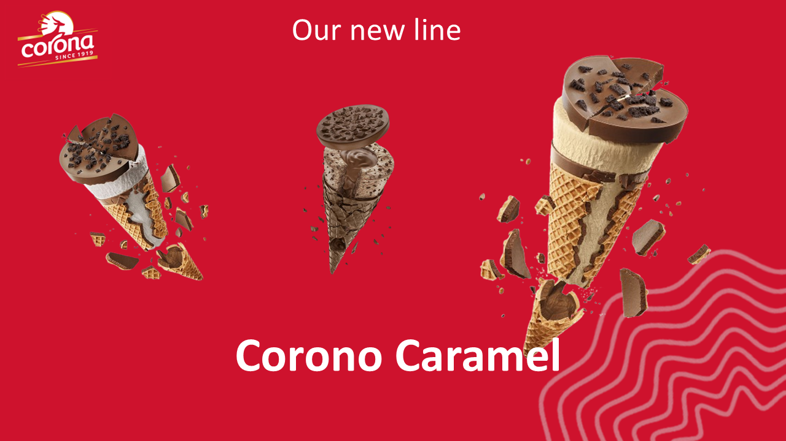
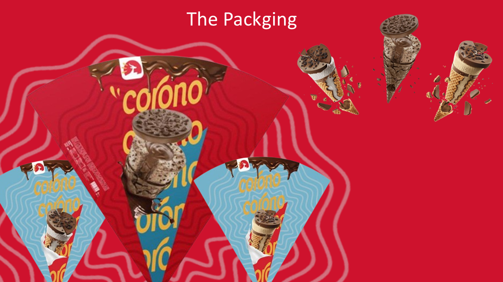

<!-- Animated Header -->
<h1 align="center">🍦 Corona Marketing Project - Corono Ice Cream</h1>
<h3 align="center">Market Study & Product Launch Strategy</h3>

<!-- Typing Animation -->

  

---

## 📖 Project Overview
This project was created as part of the **Management of Marketing** course at Helwan University (BIS Department).  
The goal was to select a **real company**, analyze its market, and propose a **new product** that could realistically be launched.

Our team chose **Corona Company**, a well-known Egyptian chocolate and confectionery brand, and proposed a new **ice cream product line** named **Corono**.

---

## 🛠 Tools & Skills Used

---

## 🎯 Objectives
- **Profit Goals:**  
  - Cover production costs  
  - Gain a major market share  

- **Brand Goals:**  
  - Establish a local, high-quality, affordable ice cream  
  - Extend Corona’s chocolate expertise into the ice cream market  
  - Engage multiple age groups

---

## 🛠 Market Analysis
- **Competitors:**  
  - Local: House of Cocoa (premium chocolates)  
  - International: Cadbury, Nestlé  
- **Consumer Trend:**  
  Recent boycotts have shifted Egyptian consumers towards locally-produced goods, giving Corona an advantage.

---

## 🎯 Target Audience
- **Children (5-12):** YouTube Kids ads, ice cream trucks, packaging prizes  
- **Teens (12-19):** Social media marketing, influencer collaborations  
- **Adults (19-40):** TV/Digital ads, focus on quality & affordability  

---

## 🍦 The New Product Line
- **Corono Max** – Rich chocolate flavor  
- **Corono Vanilla** – Classic creamy vanilla  
- **Corono Caramel** – Smooth caramel blend  

---

## 💰 Pricing Strategy
**Unit Cost Breakdown (EGP):**
- Raw materials: 6.00  
- Packaging: 1.50  
- Manufacturing: 2.00  
- Distribution: 1.00  
- Marketing: 1.50  
- **Total Cost:** 12.00  
**Final Price:** EGP 18.00  

---

## 🖼 Project Slides

---

## 📌 Notes
This project demonstrates **market research**, **strategic marketing planning**, and **product launch execution** skills.  
It can be used as a portfolio piece for **Business Analysis** and **Marketing** positions.
